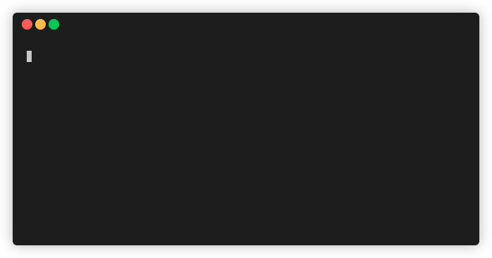

# Hooksman (Hooks Manager)

[](https://pub.dev/packages/hooksman)



## Overview

The `hooksman` package allows you to manage and execute Git hooks using Dart. You can define your hooks as Dart files and register them with Git to run automatically when the corresponding events occur (e.g., pre-commit, post-commit, etc.).

Run shell commands, Dart code, or a combination of both in your hooks to enforce coding standards, run tests, or perform other tasks.

## Installation

Add `hooksman` to your `pubspec.yaml`:

```bash
dart pub add hooksman --dev
```

Then, run `dart pub get` to install the package.

## Register Hooks

To register your hooks with Git, run the following command:

```sh
dart run hooksman
```

This command will compile your hooks and copy the executables to the hooks directory.

> [!WARNING]
> The `hooksman` package will overwrite **all** existing hooks in the `.git/hooks` directory with the new hooks. Make sure to back up any existing hooks before running the `hooksman` command.

## Hooks

### Create Hooks Directory

Create a `hooks` directory in the root of your project to store your hooks.

```tree
.
├── hooks
├── lib
│   └── ...
└── pubspec.yaml
```

### Create Hook

Create your hooks as Dart files in the `hooks` directory. Each file should contain a `main` function that returns a `Hook` object, imported from the `hooksman` package.

```dart
import 'package:hooksman/hooksman.dart';

Hook main() {
    return Hook(
        ... // Tasks
    );
}
```

> [!NOTE]
>
> `hooksman` scans the `hooks` directory for Dart files to use as hooks. You can organize your code by placing additional Dart files in subdirectories within the `hooks` directory. These files can be imported into your hook files and will not be picked up by `hooksman` as hooks.
>
> ```bash
> .
> └── hooks
>     ├── tasks
>     │   ├── some_dart_task.dart # ignored
>     │   └── ...
>     └── pre_commit.dart # picked up
> ```

> [!TIP]
>
> Look at the git hooks documentation for more information on the available hooks: [Git Hooks Documentation](https://git-scm.com/docs/githooks).

## Tasks

Tasks are modular units of work that you define to be executed during specific Git hook events. They allow you to automate checks, validations, or any custom scripts to ensure code quality and consistency across your repository. Tasks are powerful because they can be customized to suit your project's needs while targeting specific files or patterns.

All top level tasks are executed in parallel, while tasks within a group are executed sequentially. This allows you to run multiple tasks concurrently and group related tasks together.

### File Patterns

You can specify file patterns to include or exclude from a task using any `Pattern` object (`Glob`, `RegExp`, `String`, etc.). Each task can have multiple include and exclude patterns.

> [!TIP]
>
> `hooksman` exposes the `Glob` class.
>
> `hooksman` also has an `AllFiles` class to match all files.

> [!NOTE]
>
> `exclude` filters any matching files before `include` is applied.

After the filters are applied, the remaining files are passed to the task's `commands` or `run` function.

### Shell Task

A `ShellTask` allows you to run shell commands.

```dart
ShellTask(
    name: 'Analyze',
    include: [Glob('**.dart')],
    exclude: [Glob('**.g.dart')],
    commands: (files) => [
        'dart analyze --fatal-infos ${files.join(' ')}',
    ],
),
```

### Dart Task

A `DartTask` allows you to run Dart code.

```dart
DartTask(
    include: [Glob('**.dart')],
    run: (files) async {
        print('Running custom task');

        return 0;
    },
),
```

### Sequential Tasks

You can group tasks together using the `SequentialTasks` class, which runs the tasks sequentially, one after the other.

```dart
SequentialTasks(
    tasks: [
        ShellTask(
            include: [Glob('**.dart')],
            commands: (files) => [
                'dart format ${files.join(' ')}',
            ],
        ),
        ShellTask(
            include: [Glob('**.dart')],
            commands: (files) => [
                'sip test --concurrent --bail',
            ],
        ),
    ],
),
```

### Parallel Tasks

You can group tasks together using the `ParallelTasks` class, which runs the tasks in parallel.

```dart
ParallelTasks(
    tasks: [
        ShellTask(
            include: [Glob('**.dart')],
            commands: (files) => [
                'dart format ${files.join(' ')}',
            ],
        ),
        ShellTask(
            include: [Glob('**.dart')],
            commands: (files) => [
                'sip test --concurrent --bail',
            ],
        ),
    ],
),
```

## Predefined Tasks

### ReRegisterHooks

The `ReRegisterHooks` task re-registers the hooks with Git. This is useful when you want to update the hooks without having to manually run the `hooksman` command.

```dart
Hook main() {
  return Hook(
    tasks: [
      ReRegisterHooks(),
    ],
  );
}
```

> [!TIP]
>
> If your `hooks` directory is not found in the root of your project, you can specify the path to the `hooks` directory to the `ReRegisterHooks` task.
>
> ```dart
> ReRegisterHooks(pathToHooksDir: 'path/to/hooks'),
> ```

## Execute Hooks

The hooks will be executed automatically by Git when the corresponding events occur (e.g., pre-commit, post-commit, etc.).

## Example

```dart
// hooks/pre_commit.dart

import 'package:hooksman/hooksman.dart';

Hook main() {
  return Hook(
    tasks: [
      ReRegisterHooks(),
      ShellTask(
        name: 'Lint & Format',
        include: [Glob('**.dart')],
        exclude: [
          Glob('**.g.dart'),
        ],
        commands: (files) => [
          'dart analyze --fatal-infos ${files.join(' ')}',
          'dart format ${files.join(' ')}',
        ],
      ),
      ShellTask(
        name: 'Build Runner',
        include: [Glob('lib/models/**.dart')],
        exclude: [Glob('**.g.dart')],
        commands: (files) => [
          'sip run build_runner build',
        ],
      ),
      ShellTask(
        name: 'Tests',
        include: [Glob('**.dart')],
        exclude: [Glob('hooks/**')],
        commands: (files) => [
          'sip test --concurrent --bail',
        ],
      ),
    ],
  );
}
```

## License

This project is licensed under the MIT License.
